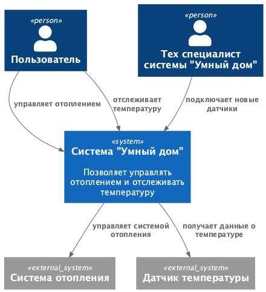
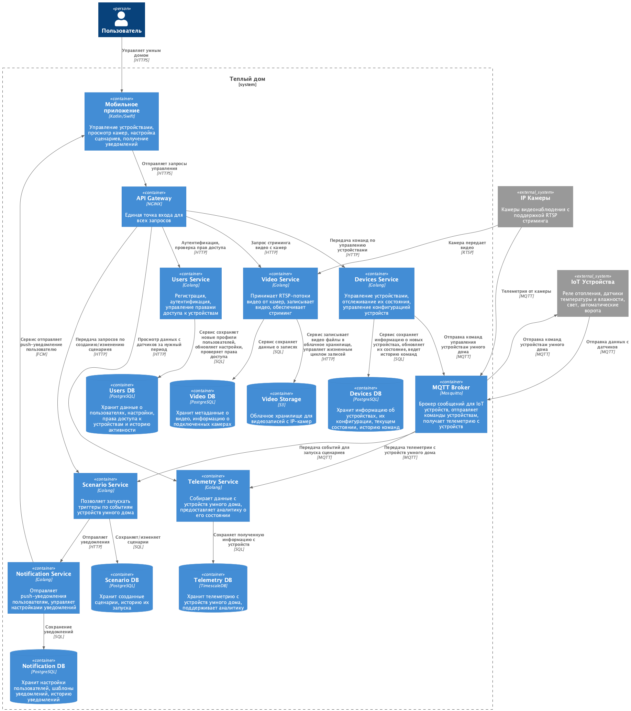
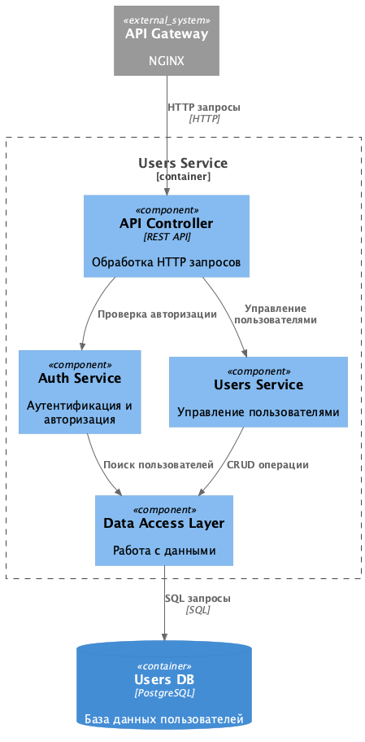
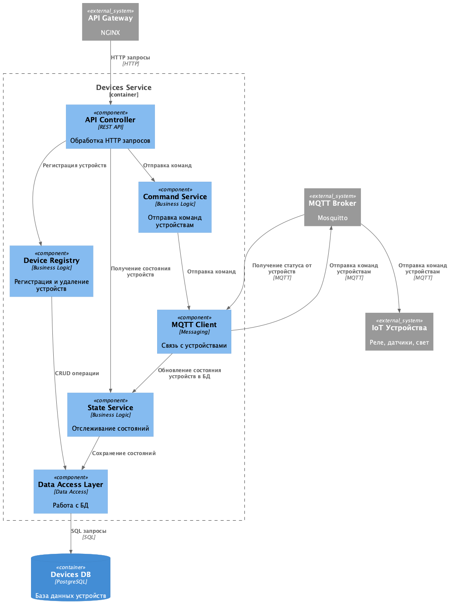
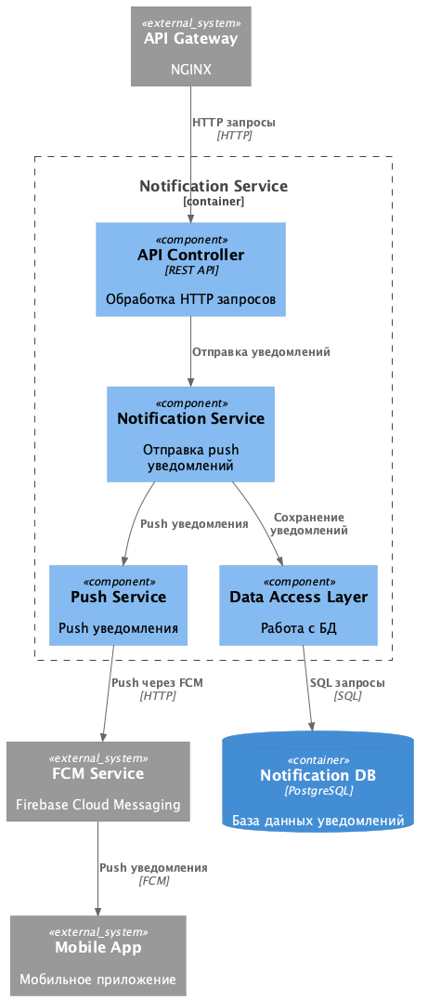
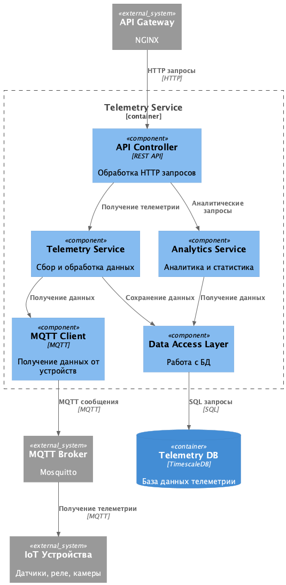
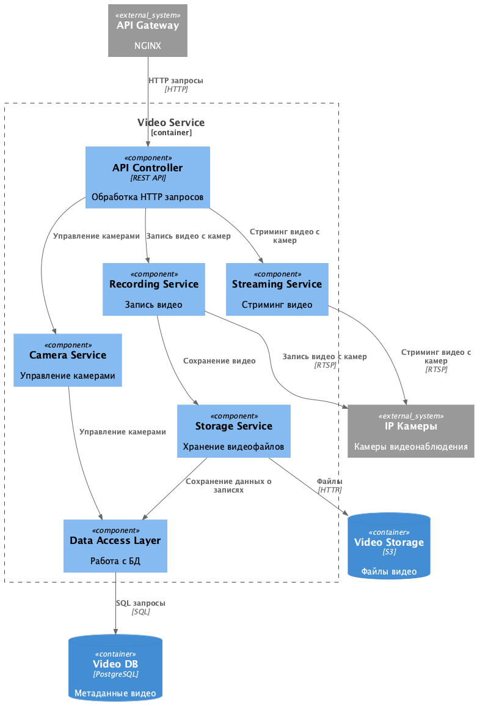
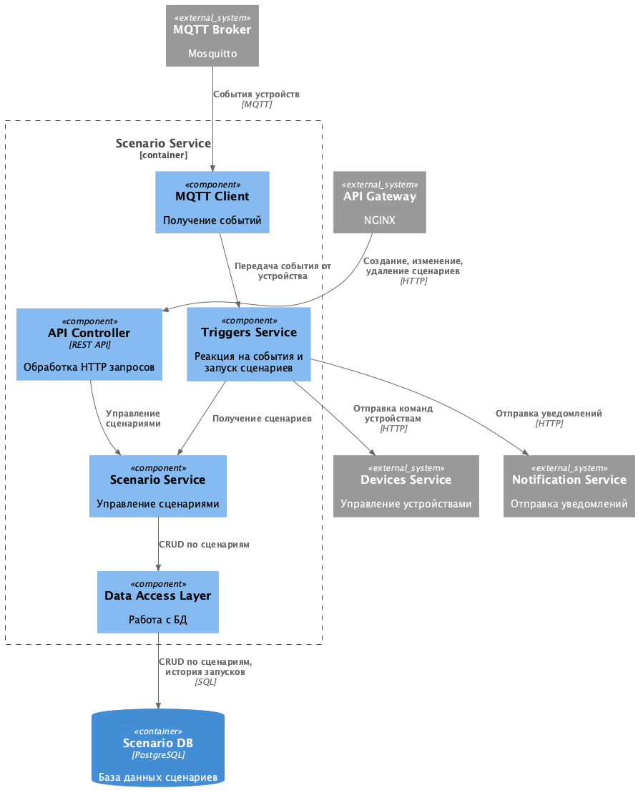
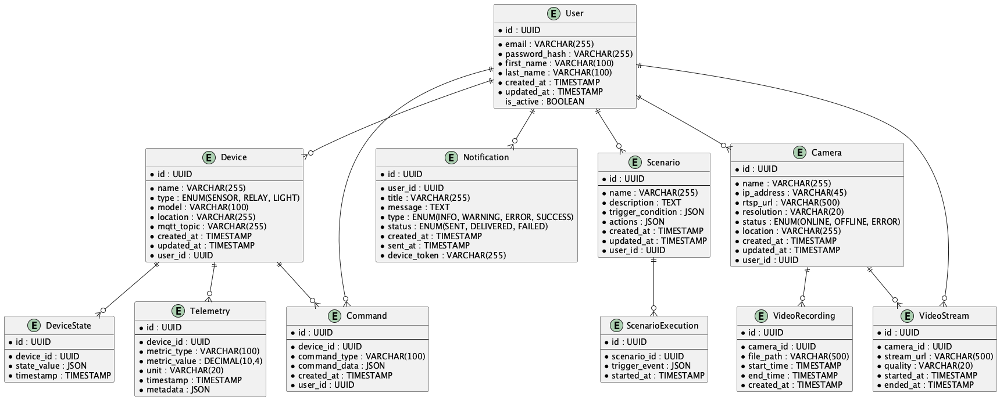

# Project_template

Это шаблон для решения проектной работы. Структура этого файла повторяет структуру заданий. Заполняйте его по мере работы над решением.

# Задание 1. Анализ и планирование

<aside>

Чтобы составить документ с описанием текущей архитектуры приложения, можно часть информации взять из описания компании и условия задания. Это нормально.

</aside

### 1. Описание функциональности монолитного приложения

**Управление отоплением:**

- Пользователи могут удалённо включать/выключать отопление в своих домах.
- Система поддерживает подключение новой системы отопления специалистом, который выезжает на дом

**Мониторинг температуры:**

- Пользователи могут просматривать текущую температуру в своих домах через веб-интерфейс.
- Система поддерживает получение данных о температуре с датчиков, установленных в домах

### 2. Анализ архитектуры монолитного приложения

- Монолит на Golang, все компоненты в одном приложении
- СУБД Postgres
- Все взаимодействие синхронное, запросы последовательные
- Сервер шлет запросы к датчикам

### 3. Определение доменов и границы контекстов

- Домен: Управление отоплением
	- Контекст: изменение режима отопления
	- Контекст: управление отоплением
- Домен: Подключение новых устройств
	- Контекст: подключение реле
	- Контекст: подключение датчиков температуры


### **4. Проблемы монолитного решения**

- Монолит сложно масштабировать по частям
- Единая точка отказа
- Нет параллельной обработки запросов
- Развертывание требует даунтайма системы

### 5. Визуализация контекста системы — диаграмма С4



```plantuml


```


# Задание 2. Проектирование микросервисной архитектуры

В этом задании вам нужно предоставить только диаграммы в модели C4. Мы не просим вас отдельно описывать получившиеся микросервисы и то, как вы определили взаимодействия между компонентами To-Be системы. Если вы правильно подготовите диаграммы C4, они и так это покажут.

**Диаграмма контейнеров (Containers)**

Добавьте диаграмму.



**Диаграмма компонентов (Components)**

Добавьте диаграмму для каждого из выделенных микросервисов.








**Диаграмма кода (Code)**

Добавьте одну диаграмму или несколько.


# Задание 3. Разработка ER-диаграммы

Добавьте сюда ER-диаграмму. Она должна отражать ключевые сущности системы, их атрибуты и тип связей между ними.



# Задание 4. Создание и документирование API

### 1. Тип API

Укажите, какой тип API вы будете использовать для взаимодействия микросервисов. Объясните своё решение.

Будет использоваться гибридный подход:
- REST API для взаимодействия с мобильным приложением было выбрано для простоты поддержки, удобства тестирования, легкого масштабирования
- MQTT для взаимодействия с устройствами умного дома как более легковесный протокол с поддержкой нужных гарантий доставки

### 2. Документация API

Здесь приложите ссылки на документацию API для микросервисов, которые вы спроектировали в первой части проектной работы. Для документирования используйте Swagger/OpenAPI или AsyncAPI.

**OpenAPI документация:** [docs/openapi.yaml](docs/openapi.yaml)


# Задание 5. Работа с docker и docker-compose

Перейдите в apps.

Там находится приложение-монолит для работы с датчиками температуры. В README.md описано как запустить решение.

Вам нужно:

1) сделать простое приложение temperature-api на любом удобном для вас языке программирования, которое при запросе /temperature?location= будет отдавать рандомное значение температуры.

Locations - название комнаты, sensorId - идентификатор названия комнаты

```
	// If no location is provided, use a default based on sensor ID
	if location == "" {
		switch sensorID {
		case "1":
			location = "Living Room"
		case "2":
			location = "Bedroom"
		case "3":
			location = "Kitchen"
		default:
			location = "Unknown"
		}
	}

	// If no sensor ID is provided, generate one based on location
	if sensorID == "" {
		switch location {
		case "Living Room":
			sensorID = "1"
		case "Bedroom":
			sensorID = "2"
		case "Kitchen":
			sensorID = "3"
		default:
			sensorID = "0"
		}
	}
```

2) Приложение следует упаковать в Docker и добавить в docker-compose. Порт по умолчанию должен быть 8081

3) Кроме того для smart_home приложения требуется база данных - добавьте в docker-compose файл настройки для запуска postgres с указанием скрипта инициализации ./smart_home/init.sql

Для проверки можно использовать Postman коллекцию smarthome-api.postman_collection.json и вызвать:

- Create Sensor
- Get All Sensors

Должно при каждом вызове отображаться разное значение температуры

Ревьюер будет проверять точно так же.


